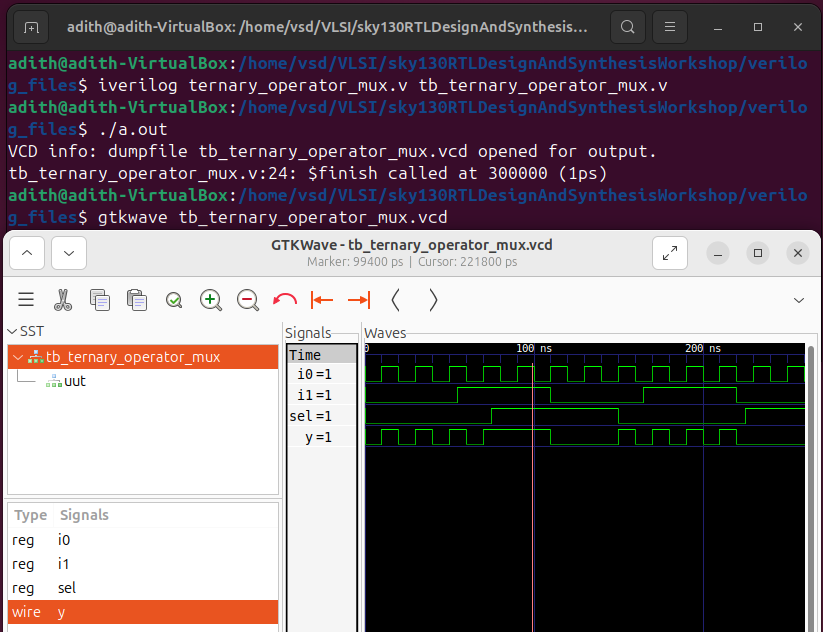
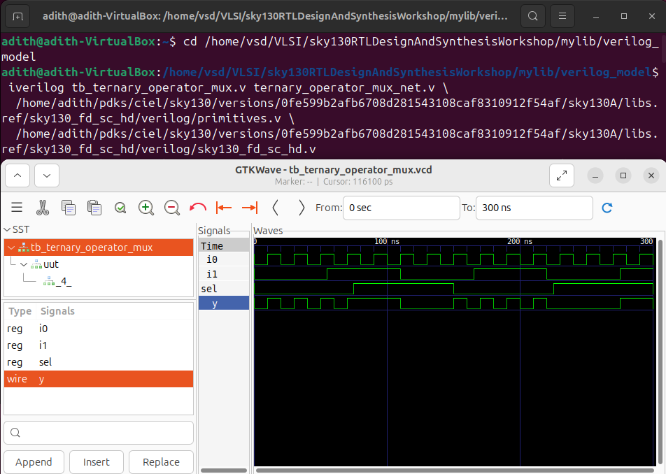
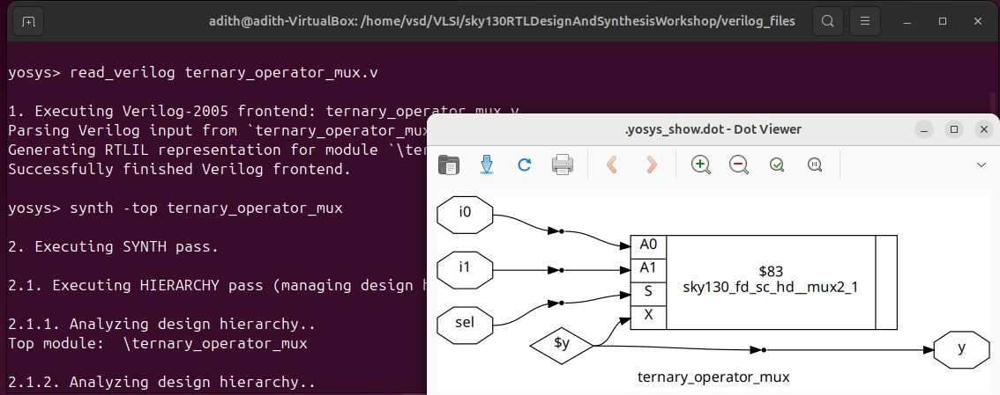
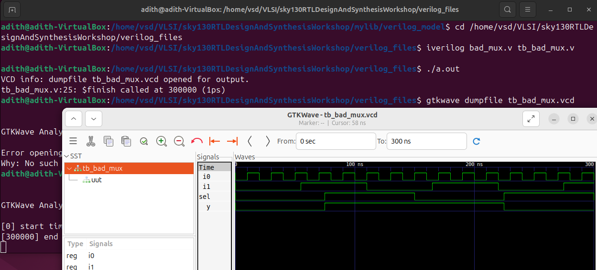
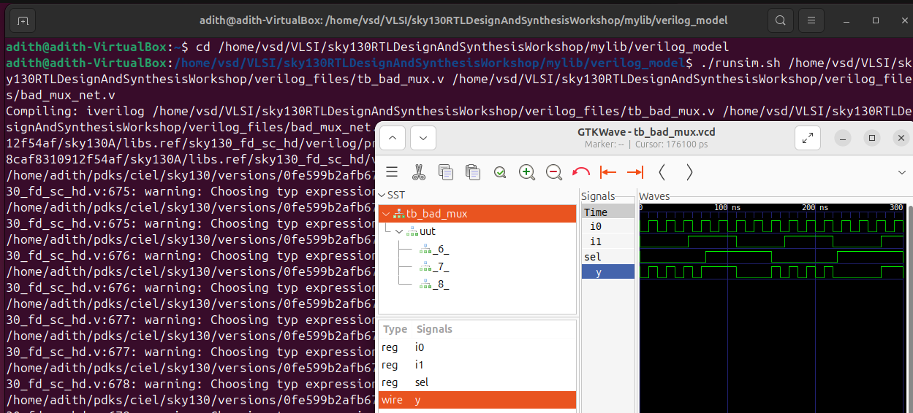
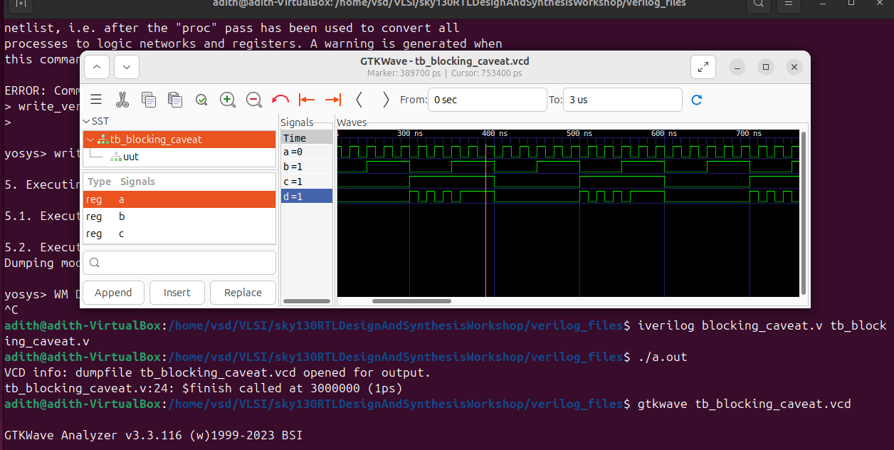
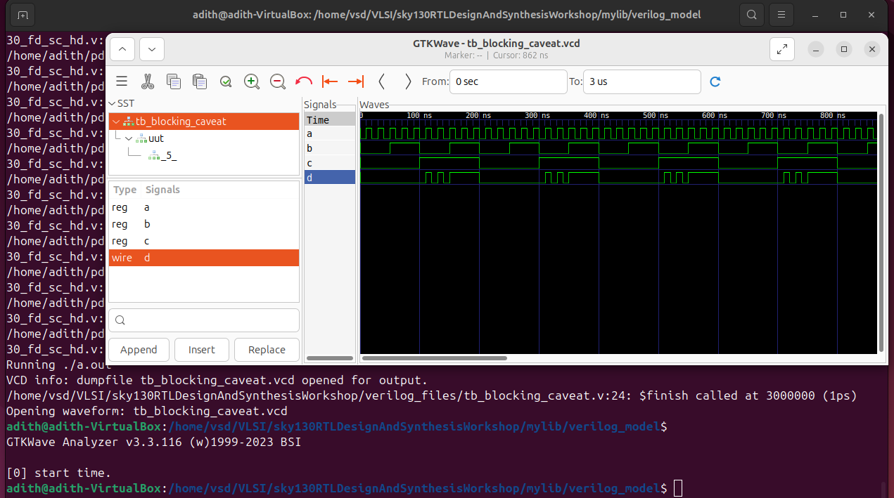

# Day 4: Gate-Level Simulation (GLS), Blocking vs. Non-Blocking in Verilog, and Synthesis-Simulation Mismatch

Welcome to **Day 4** of the RTL Workshop! Today’s session focuses on three essential topics in digital design:

* **Gate-Level Simulation (GLS)**
* **Blocking vs. Non-Blocking Assignments in Verilog**
* **Synthesis-Simulation Mismatch**

You’ll learn both the theory and practical implications, complete with hands-on labs to reinforce your understanding.

---

## Table of Contents

1. [Gate-Level Simulation (GLS)](#1-gate-level-simulation-gls)
2. [Synthesis-Simulation Mismatch](#2-synthesis-simulation-mismatch)

   * [2.1 Examples of Mismatches](#21-examples-of-mismatches)
3. [Blocking vs. Non-Blocking Assignments in Verilog](#3-blocking-vs-non-blocking-assignments-in-verilog)

   * [3.1 Blocking Statements](#31-blocking-statements)
   * [3.2 Non-Blocking Statements](#32-non-blocking-statements)
   * [3.3 Comparison Table](#33-comparison-table)
   * [3.4 Shift Register Example](#34-shift-register-example)
4. [Labs](#4-labs)

   * [Lab 1: Ternary Operator MUX (Correct Case)](#lab-1-ternary-operator-mux-correct-case)
   * [Lab 2: Synthesis of MUX](#lab-2-synthesis-of-mux)
   * [Lab 3: GLS of MUX](#lab-3-gls-of-mux)
   * [Lab 4: Bad MUX (Mismatch Example)](#lab-4-bad-mux-mismatch-example)
   * [Lab 5: GLS of Bad MUX](#lab-5-gls-of-bad-mux)
   * [Lab 6: Blocking Caveat (Mismatch Example)](#lab-6-blocking-caveat-mismatch-example)
  
5. [Summary and Best Practices](#5-summary-and-best-practices)

---

## 1. Gate-Level Simulation (GLS)

**Definition**:
Gate-Level Simulation is the process of running a testbench on the **synthesized netlist** of a design rather than the RTL source code.

* **RTL Simulation**: DUT is the RTL behavioral description.
* **GLS**: DUT is the gate-level netlist (made of AND, OR, FFs, etc.) generated after synthesis.

### Why Perform GLS?

* **Synthesis Validation**: Ensures RTL → Netlist translation is correct.
* **Timing Verification**: With SDF annotation, verifies setup/hold constraints.
* **Testability**: Validates scan chains and DFT structures.

### When is GLS Done?

* After synthesis, before physical design.

### Types of GLS

* **Functional GLS** → Logic-only, zero/unit delays.
* **Timing GLS** → Annotated with `.sdf` for real delays.

### GLS Flow Using Icarus Verilog

```bash
iverilog /path/to/primitives.v /path/to/sky130_fd_sc_hd.v design_net.v testbench.v
./a.out
gtkwave dump.vcd
```

📌 **Note**: Standard cell models must be included. They can be **functional models** (logic only) or **timing-aware models** (with delays).

---

## 2. Synthesis-Simulation Mismatch

A **synthesis-simulation mismatch** happens when RTL simulation ≠ GLS simulation.

### Common Causes

* Non-synthesizable constructs (delays, `initial`, `$display`)
* Incomplete sensitivity lists in combinational always blocks
* Improper use of blocking `=` vs. non-blocking `<=`
* Ambiguous or poorly structured RTL

---

## 2.1 Examples of Mismatches

### Example 1: Bad MUX (Missing Sensitivity List)

```verilog
module bad_mux (input i0, input i1, input sel, output reg y);
  always @(sel) begin
    if (sel)
      y <= i1;
    else
      y <= i0;
  end
endmodule
```

❌ Issues:

* Sensitivity list only includes `sel`, but `i0` and `i1` also affect output.
* Non-blocking assignment used in combinational logic.

📌 **Mismatch**:

* RTL sim → behaves incorrectly (not a mux).
* GLS sim → behaves correctly (mux).

✅ Corrected:

```verilog
always @(*) begin
  if (sel)
    y = i1;
  else
    y = i0;
end
```

---

### Example 2: Blocking Caveat in Combinational Logic

```verilog
module blocking_caveat (input a, input b, input c, output reg d);
  reg x;
  always @(*) begin
    d = x & c;   // stale value of x
    x = a | b;   // x updated later
  end
endmodule
```

❌ Mismatch because `d` uses old `x`.

✅ Corrected:

```verilog
always @(*) begin
  x = a | b;
  d = x & c;
end
```

---

### Example 3: Sequential Blocking Caveat (Shift Register)

```verilog
always @(posedge clk, posedge reset) begin
  if (reset) begin
    q0 = 1'b0;
    q  = 1'b0;
  end else begin
    q  = q0;   // old q0
    q0 = d;    // updated after
  end
end
```

❌ Wrong: Order makes `q` capture stale `q0`.

✅ Correct (Non-Blocking):

```verilog
always @(posedge clk, posedge reset) begin
  if (reset) begin
    q0 <= 1'b0;
    q  <= 1'b0;
  end else begin
    q0 <= d;
    q  <= q0;
  end
end
```

---

## 3. Blocking vs. Non-Blocking Assignments in Verilog

### 3.1 Blocking (`=`)

* Sequential, immediate execution.
* Use in **combinational logic**.

### 3.2 Non-Blocking (`<=`)

* Parallel, scheduled execution.
* Use in **sequential logic**.

### 3.3 Comparison Table

| Feature           | Blocking (`=`)        | Non-Blocking (`<=`) |
| ----------------- | --------------------- | ------------------- |
| Operator          | `=`                   | `<=`                |
| Execution         | Sequential, immediate | Parallel, scheduled |
| Best use          | Combinational logic   | Sequential logic    |
| Order             | Matters               | Doesn’t matter      |
| Hardware inferred | Gates                 | Flip-flops          |

### 3.4 Shift Register Example

See [Example 3](#example-3-sequential-blocking-caveat-shift-register).

---

## 4. Labs

### Lab 1: Ternary Operator MUX (Correct Case)

```verilog
module ternary_operator_mux (input i0, input i1, input sel, output y);
  assign y = sel ? i1 : i0;
endmodule
```

✅ Correct design: RTL sim, synthesis, GLS → all match.

  
  

---

### Lab 2: Synthesis of MUX

Run Yosys synthesis for `ternary_operator_mux`.

  

---

### Lab 3: GLS of MUX

Run GLS using Icarus with standard-cell models.

```markdown
  
```

---

### Lab 4: Bad MUX (Mismatch Example)

See [Example 1](#example-1-bad-mux-missing-sensitivity-list).

  
  

---

### Lab 5: GLS of Bad MUX

Observe mismatch between RTL sim and GLS.

  

---

### Lab 6: Blocking Caveat (Mismatch Example)

See [Example 2](#example-2-blocking-caveat-in-combinational-logic).

  
  

## 5. Summary and Best Practices

* **GLS** validates synthesized netlist functionality, timing, and DFT.
* **Synthesis-Simulation Mismatches** arise due to poor coding (bad sensitivity lists, wrong assignments).
* **Blocking vs Non-Blocking:**

  * Use `=` for combinational (`always @(*)`).
  * Use `<=` for sequential (`always @(posedge clk)`).
* **Golden Rules:**

  * Never mix `=` and `<=` in the same block.
  * Always include complete sensitivity lists.
  * Always run both RTL and GLS simulations.
* **Correct vs Incorrect:**

  * Ternary MUX → Correct (baseline).
  * Bad MUX, Blocking Caveats → Incorrect, cause mismatches.

```markdown
  
```

---

✅ **Day 4 Takeaway**: GLS is the *bridge* between RTL and real hardware. Correct Verilog style (proper sensitivity lists, correct assignment usage) ensures consistency across RTL, synthesis, GLS, and silicon.
