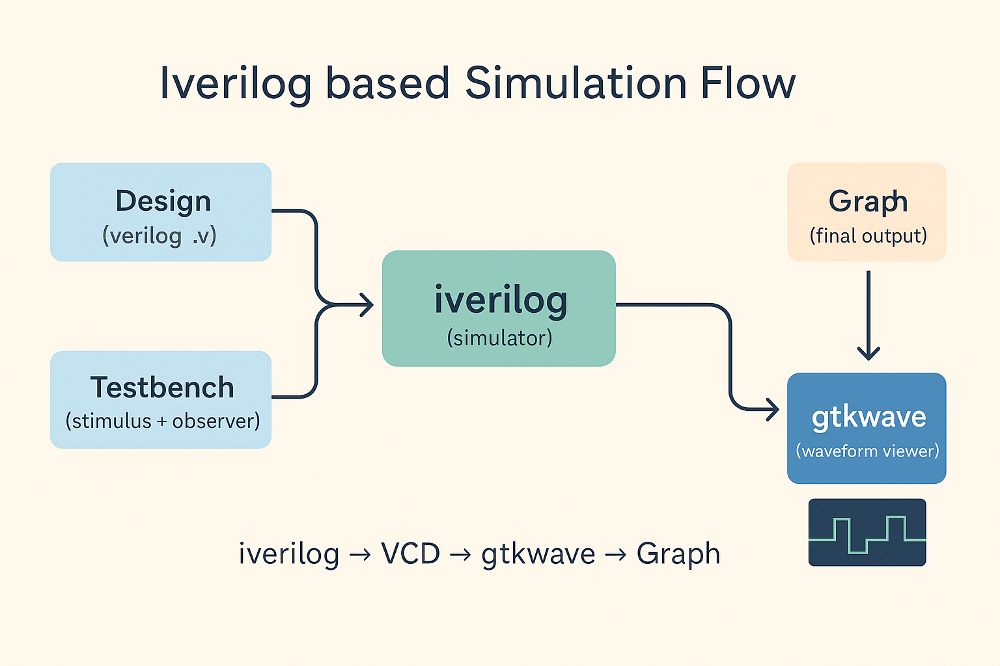
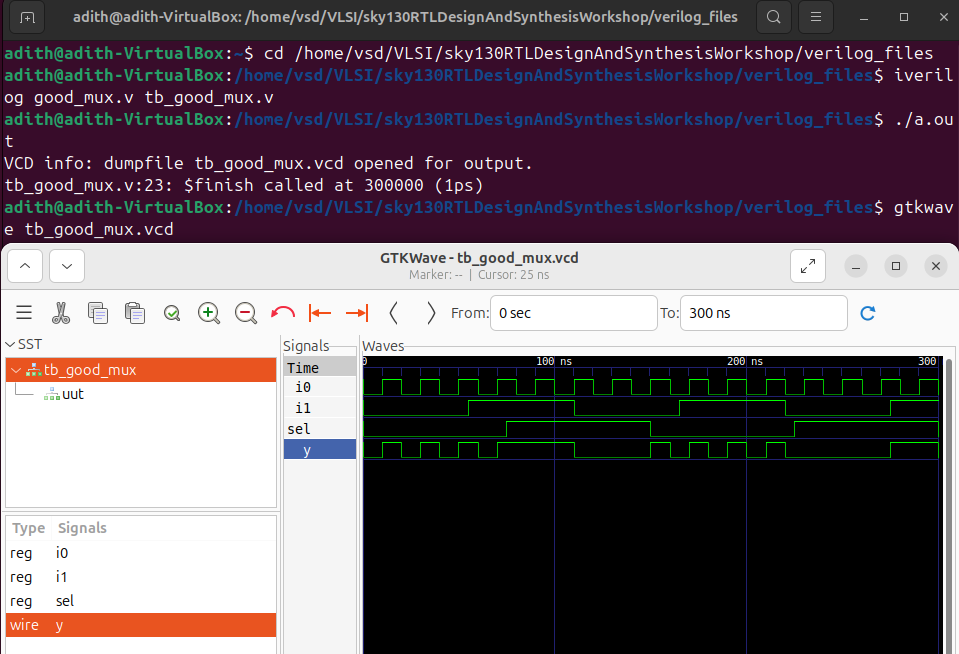
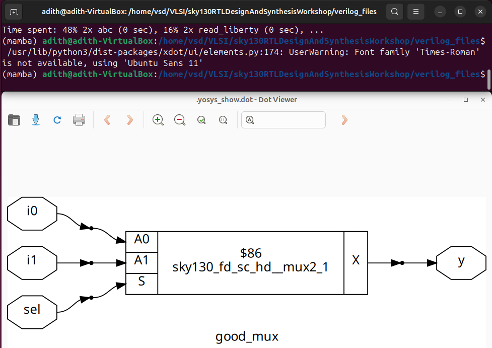

# 🗓️ Day 1 – Introduction to iverilog, Design, and Testbench  

Welcome to Day 1. Here we write a small Verilog module (a 2→1 multiplexer), verify it with a testbench, simulate it using iverilog, and view the waveforms in gtkwave. Finally, you’ll synthesize the same RTL to a gate-level netlist with Yosys using the Sky130 library.

---

### 🔹 Simulator (iverilog)  
Think of a simulator as a **virtual lab** where we check if our Verilog design behaves correctly.  

- The design (RTL code) is just text, but we need to know: “Does this text actually behave like the hardware we want?”  
- That’s where a simulator comes in — it **runs the design and mimics hardware behavior**.  

How it works:  
- A simulator is **event-driven**: it watches inputs.  
- When inputs change → it recalculates outputs.  
- If inputs don’t change → nothing happens, outputs stay the same.  
- This simple rule is the foundation of all future simulations.  

We will use **iverilog** as our simulator in this workshop.  

---

### 🔹 Design  
- The **design** is the actual Verilog code describing the circuit (e.g., inverter, multiplexer).  
- It’s written to satisfy the given specification.  
- Example: If spec says “output should be the NOT of input A,” the design is the Verilog code that implements that.  
```verilog
Below is the 2-to-1 multiplexer design used in the labs
module good_mux (input i0 , input i1 , input sel , output reg y);
always @ (*)
begin

    if(sel)
        y <= i1;
    else
        y <= i0;

end
endmodule
```
---

### 🔹 Testbench  
Once we write a design, how do we **check it works**? → We need a **testbench**.  

- A **testbench** applies inputs (stimulus/test vectors) and observes outputs.  
- The testbench doesn’t have primary I/O like the design does. Instead, it:  
  - Instantiates the design.  
  - Generates test inputs (stimulus).  
  - Collects/observes the outputs.  

```verilog
Below is the testbench used in Lab 1 to simulate the `good_mux` 2:1 multiplexer
`timescale 1ns / 1ps
module tb_good_mux;

    // Inputs
    reg i0,i1,sel;
    // Outputs
    wire y;

    // Instantiate the Unit Under Test (UUT)
    good_mux uut (
        .sel(sel),
        .i0(i0),
        .i1(i1),
        .y(y)
    );

    initial begin
        $dumpfile("tb_good_mux.vcd");
        $dumpvars(0,tb_good_mux);
        // Initialize Inputs
        sel = 0;
        i0 = 0;
        i1 = 0;
        #300 $finish;
    end

    always #75 sel = ~sel;
    always #10 i0 = ~i0;
    always #55 i1 = ~i1;

endmodule
``` 

 
- **Design**: has inputs and outputs.  
- **Testbench**: has a stimulus generator (inputs) + observer (outputs).  
- Design is placed inside the testbench for verification.  

---

### 🔹 Iverilog-Based Simulation Flow  
Here’s how the whole process looks:  
1. Write **design code** and a **testbench**.  
2. Feed both into **iverilog** (the simulator).  
3. Iverilog produces a **VCD file (Value Change Dump)**.  
   - This file records how signals changed over time.  
4. Open the VCD file in **gtkwave** to see waveforms.  
   - You can literally see inputs toggling and outputs responding.  

This is how we connect coding → simulation → waveform visualization.  

---
---

## 🧪 Lab 1 – Simulating a 2-to-1 Multiplexer  

### 🎯 Objective – What Are We Trying to Achieve?  
- Understand how a **design (RTL code)** and a **testbench** work together in simulation.  
- Learn the **iverilog workflow**: compiling → simulating → generating VCD → viewing waveforms in gtkwave.  
- Observe how a simulator reacts to input changes and evaluates outputs.  
- Verify that the **multiplexer design** behaves according to its specification.  

---

### 📝 Steps – What Is Done in This Lab?  

**Step 1: Clone the Repository**  
```bash
git clone https://github.com/kunalg123/sky130RTLDesignAndSynthesisWorkshop.git
cd sky130RTLDesignAndSynthesisWorkshop/verilog_files
```
**Step 2: Install Tools**
```bash
sudo apt install iverilog
sudo apt install gtkwave
```
- iverilog = simulator (runs design + testbench).
- gtkwave = waveform viewer (visualizes simulation output).

**Step 3: Compile the Design + Testbench**

```bash
iverilog good_mux.v tb_good_mux.v
```
-Compiles both the design file (good_mux.v) and the testbench file (tb_good_mux.v).
-Produces an executable simulation file (a.out).

***Step 4: Run the Simulation***

```bash
./a.out
```
-Executes the compiled code.
-Generates a VCD (Value Change Dump) file with all signal transitions.

***Step 5: View the Waveform in gtkwave***

```bash
gtkwave tb_good_mux.vcd
```
-Opens the waveform viewer.
You will see:
-Inputs (sel, in0, in1).
-Output (out) responding correctly.


---

### 📚 What Do We Learn From This Lab?

-Simulation flow in action: design + testbench → simulate → VCD → waveform.
-Testbench role: provides stimulus and observes outputs automatically.
-Simulator behavior: outputs update only when inputs change (event-driven).

***Verification: confirmed that mux design works***

-If sel=0 → output = in0.

-If sel=1 → output = in1.

---

### 🔹 Yosys (Introduction to Logic Synthesis)  
Simulation is only half the story.  
Ultimately, we don’t want just code — we want a **circuit** (gates, flip-flops).  

That’s where **Yosys** comes in. It’s a **synthesizer**:  
- Converts RTL → **netlist** (gates + connections).  

**Design Flow in Yosys:**  
- Inputs:  
  - RTL design (`.v`).  
  - Library file (`.lib`) → contains standard cell definitions (AND, OR, NOT, flip-flops).  
- Commands:  
  - `read_verilog <design.v>`  
  - `read_liberty <library.lib>`  
  - `write_verilog <netlist.v>`  
- Output: a **netlist** (design represented using gates available in `.lib`).  

**How do we check synthesis worked?**  
- Simulate the **netlist** using the **same testbench** in iverilog.  
- Compare waveforms of:  
  - RTL simulation  
  - Netlist simulation  
- If they match → synthesis is correct.  

---

### 🔹 Logic Synthesis Concepts  
- **RTL Design**: behavioral code (what the design should *do*).  
- **Synthesis**: translation of RTL → gate-level representation.  
- Output is a **netlist** (actual digital circuit).  

---

### 🔹 What is `.lib` (Library File)?  
The `.lib` is like a **toolbox of gates and flip-flops**.  
- Contains many versions of gates (2-input AND, 3-input AND, fast/slow versions, etc.).  

Why so many versions? Timing!  
- Imagine two flip-flops (A → logic → B).  
- The maximum speed (frequency) depends on:  
  - Propagation delay of flop A.  
  - Delay through the logic in between.  
  - Setup time of flop B.  
- The clock period must be **longer than this total delay** → sets max frequency.  

But there’s another side: **hold time**.  
- If signals reach flop B *too quickly*, data could be captured in the same cycle → error.  
- Hold time ensures data doesn’t change too soon after the clock edge.  
- **Slow cells** are used to guarantee signals don’t arrive too early.  

So:  
- Fast cells = for performance.  
- Slow cells = for reliability (fix hold time).  
- `.lib` contains many cell choices so synthesis can pick the right balance.  

---

## 🧪 Lab 2 – Synthesis Lab with Yosys and Sky130

### 🎯 Objective – What Are We Trying to Achieve?
- Convert the RTL design (`good_mux.v`) into a gate-level netlist mapped to the Sky130 standard cell library.
- Learn the Yosys flow: loading a `.lib`, reading Verilog, synthesizing RTL, running technology mapping (ABC) with a `.lib`, and visualizing the mapped gate-level netlist.
- Understand how the `.lib` (Sky130) is used to pick actual cells (and their timing variants) during mapping.

---

### 📝 Step-by-step – Exactly What Is Done in This Lab

**Start Yosys**
```bash
yosys
```
**Read the liberty library**
```bash
read_liberty -lib /address/to/your/sky130/file/sky130_fd_sc_hd__tt_025C_1v80.lib
```
**Read the Verilog design**
```bash
read_verilog /home/vsduser/VLSI/sky130RTLDesignAndSynthesisWorkshop/verilog_files/good_mux.v
```
**Synthesize the design**
```bash
synth -top good_mux
```
**Technology mapping (ABC)**
```bash
abc -liberty /address/to/your/sky130/file/sky130_fd_sc_hd__tt_025C_1v80.lib
```
**Visualize the gate-level netlist**
```bash
show
```


---

## 💡 Key Takeaways  

- **Simulator (iverilog)**: checks RTL behavior.  
- **Design**: Verilog code that meets the specification.  
- **Testbench**: generates inputs & observes outputs — no primary I/O.  
- **Simulation flow**: design + testbench → iverilog → VCD → gtkwave.  
- **Yosys**: converts RTL into gate-level netlist using `.lib`.  
- **.lib**: contains multiple versions of gates to balance speed vs. timing requirements.  
- Circuits must be **fast but not too fast** → synthesis chooses cells accordingly.  
