# 📘 Day 2 — Timing Libraries, Hierarchical vs Flat Synthesis, and Flip-Flop Coding Styles

This README explains what I learned in **Day-2 of the Sky130 RTL Design and Synthesis Workshop**.  
---
## 🔹 1. Introduction to Timing Libraries

### 📖 What are timing libraries?
In digital VLSI, **timing libraries (`.lib` files)** describe how standard cells (AND, OR, INV, DFF, etc.) behave in silicon.  
They provide:

- **Function** → Boolean logic (`(A & B)`, `(~A)`).  
- **Timing** → propagation delays and transition times.  
- **Power** → leakage power and internal switching energy.  
- **Area** → how much silicon the cell occupies.  
- **Pins** → capacitance, direction, related power/ground.  

📌 Without these, synthesis tools like Yosys cannot map RTL into real gates.

---

### ⚡ Why do we need multiple `.lib` files?

Each `.lib` is characterized at a **PVT corner**:

- **Process** → silicon variations (slow, typical, fast).  
- **Voltage** → operating supply (e.g., 1.8 V).  
- **Temperature** → environment (e.g., 25 °C, 125 °C).  

Example file:  
```

sky130\_fd\_sc\_hd\_\_tt\_025C\_1v80.lib

````
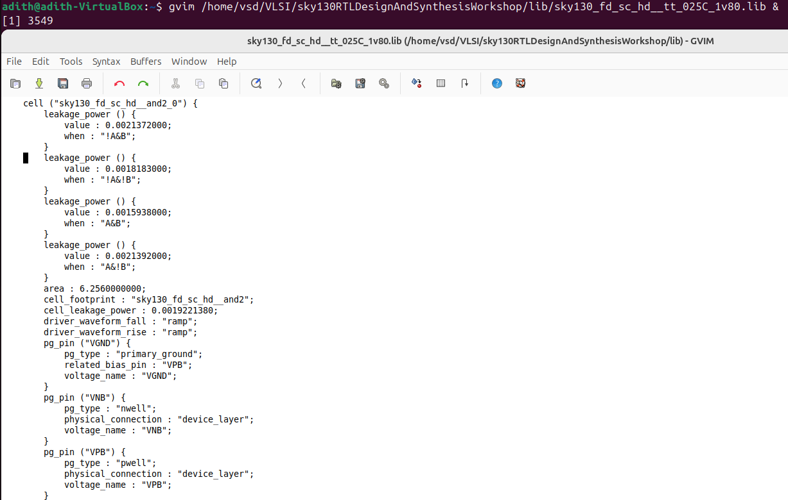


- `tt` → typical process  
- `025C` → 25 °C  
- `1v80` → 1.8 V supply  

📌 Tools use these libraries to ensure our chip works across all realistic conditions.

---

### 📂 Inside a `.lib` file

**Header section:**
```text
technology("cmos");
delay_model : "table_lookup";
time_unit : "1ns";
voltage_unit : "1V";
leakage_power_unit : "1nW";
capacitive_load_unit(1.0, "pf");
````

Defines technology, delay model, and measurement units.

**Operating conditions:**

```text
operating_conditions("tt_025C_1v80") {
  voltage : 1.8;
  process : 1.0;
  temperature : 25;
}
```

States the PVT corner.

**Cell definition:**

```text
cell ("sky130_fd_sc_hd__and2_0") {
   area : 6.25;
   pin("A") { direction: input; capacitance: 0.002; }
   pin("B") { direction: input; capacitance: 0.002; }
   pin("X") { direction: output; function: "(A&B)"; }
   timing() { cell_rise {...} cell_fall {...} }
}
```

* **Function:** `X = A & B`
* **Area:** 6.25 (µm²)
* **Timing:** lookup tables for delays and output slews

---

### 🔎 Comparing cells

* `and2_0` → weaker drive, smaller area, higher delay
* `and2_1` → stronger drive, larger area, lower delay

📌 **Takeaway:** `.lib` files are the **datasheets of standard cells**. They let us balance **area, power, and speed**.

---

## 🔹 2. Hierarchical vs Flat Synthesis

### 📖 What exactly is Hierarchical vs Flat Synthesis?

When we write RTL, we often use **submodules** to organize logic.

Example:

```verilog
module sub_module1(input a,b,output y);
    assign y = a & b;
endmodule

module sub_module2(input a,b,output y);
    assign y = a | b;
endmodule

module multiple_modules(input a,b,c,output y);
    wire net1;
    sub_module1 u1(.a(a),.b(b),.y(net1));
    sub_module2 u2(.a(net1),.b(c),.y(y));
endmodule
```

Here:

$$
y = (a \cdot b) + c
$$

---

### Hierarchical synthesis

* Keeps `u1` and `u2` visible in the netlist.
* Easy to trace back to RTL.
* Faster compile for big designs.
* Limited optimizations across module boundaries.
---

### Flattened synthesis

* Submodules are collapsed into a single module.
* Enables global optimizations.
* Harder to debug because original structure is lost.

---

### 🔄 Tabular Comparison

| Aspect       | Hierarchical  | Flattened            |
| ------------ | ------------- | -------------------- |
| Structure    | Preserved     | Collapsed            |
| Optimization | Local         | Global               |
| Debugging    | Easier        | Harder               |
| Runtime      | Faster        | Slower               |
| Use case     | Modular flows | Maximum optimization |

---

### 🧪 Examples We Used to Verify Hierarchical vs Flat Synthesis

**Design used:** `multiple_modules.v` (code shown above)

---
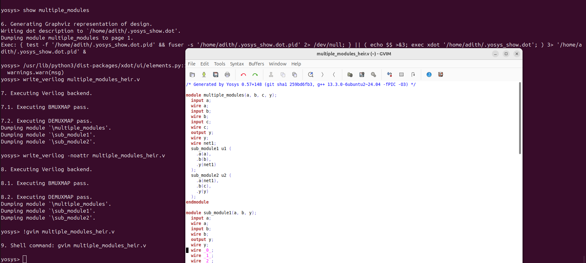

✅ **Step 1: Hierarchical Synthesis**

```yosys
read_verilog multiple_modules.v
read_liberty -lib sky130_fd_sc_hd__tt_025C_1v80.lib
synth -top multiple_modules
show
```

**Result:**

* The netlist still shows submodules (`u1`, `u2`).
* Each corresponds to one RTL submodule.

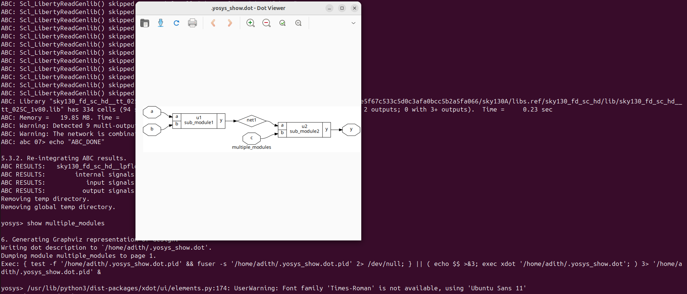

---

✅ **Step 2: Flattened Synthesis**

```yosys
flatten
show
```

**Result:**

* The submodules disappear.
* Instead, Sky130 standard cells are visible:

  * `sky130_fd_sc_hd__and2_0` (for AND)
  * `sky130_fd_sc_hd__or2_0` (for OR, sometimes replaced by isolation cell)

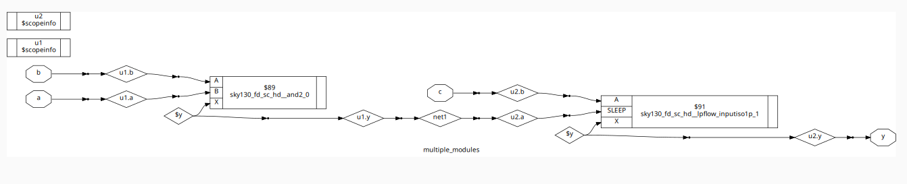

---

✅ **Step 3: Verification with Truth Table**

We confirmed the flattened netlist produces the same output.

\| a | b | c | y = (a\&b)|c |
\|---|---|---|--------------|
\| 0 | 0 | 0 |       0      |
\| 0 | 0 | 1 |       1      |
\| 0 | 1 | 0 |       0      |
\| 0 | 1 | 1 |       1      |
\| 1 | 0 | 0 |       0      |
\| 1 | 0 | 1 |       1      |
\| 1 | 1 | 0 |       1      |
\| 1 | 1 | 1 |       1      |

**Testbench snippet:**

```verilog
for (i=0; i<8; i=i+1) begin
  {a,b,c} = i; #1;
  $display("%b %b %b -> %b", a,b,c,y);
end
```
📌 **Summary of Example**

1. RTL synthesized hierarchically → saw `u1` and `u2`.
2. Flattened → saw only Sky130 standard cells (`and2_0`, `or2_0`).
3. Simulated → verified truth table correctness.

---

## 🔹 3. Flip-Flop Coding Styles & Glitch Avoidance

### 📖 Why Flops?

* Purely combinational logic can glitch because signals arrive at different times.
* Example: `(a&b)|c` may briefly output `0` when inputs change.
* **Flip-flops** stabilize signals by updating only on clock edges.

📌 **Rule:** Reliable synchronous circuits follow → combinational → flop → combinational → flop.

---

#### 1. DFF with Asynchronous Reset

```verilog
module dff_asyncres(input clk, input async_reset, input d, output reg q);
  always @(posedge clk, posedge async_reset)
    if (async_reset)
      q <= 1'b0;
    else
      q <= d;
endmodule
```
📷 Asynchronous Reset DFF synthesized in Yosys:
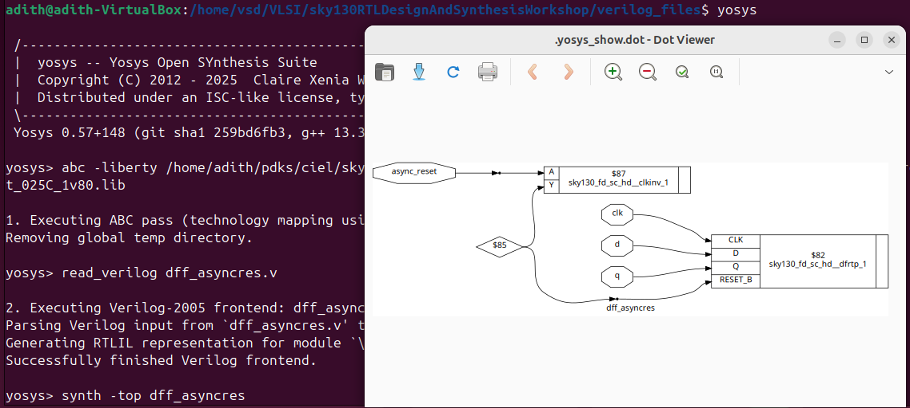


Reset works immediately, regardless of clock.

---

#### 2. DFF with Asynchronous Set

```verilog
module dff_asyncset(input clk, input async_set, input d, output reg q);
  always @(posedge clk, posedge async_set)
    if (async_set)
      q <= 1'b1;
    else
      q <= d;
endmodule
```
📷 Asynchronous Set DFF synthesized in Yosys:
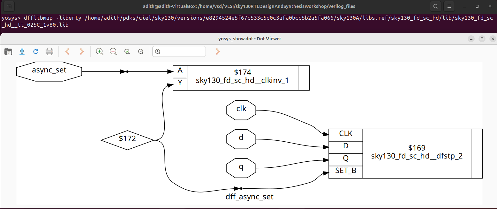
Set works immediately, regardless of clock.

---

#### 3. DFF with Synchronous Reset

```verilog
module dff_syncres(input clk, input sync_reset, input d, output reg q);
  always @(posedge clk)
    if (sync_reset)
      q <= 1'b0;
    else
      q <= d;
endmodule
```
📷 Synchronous Reset DFF synthesized in Yosys:
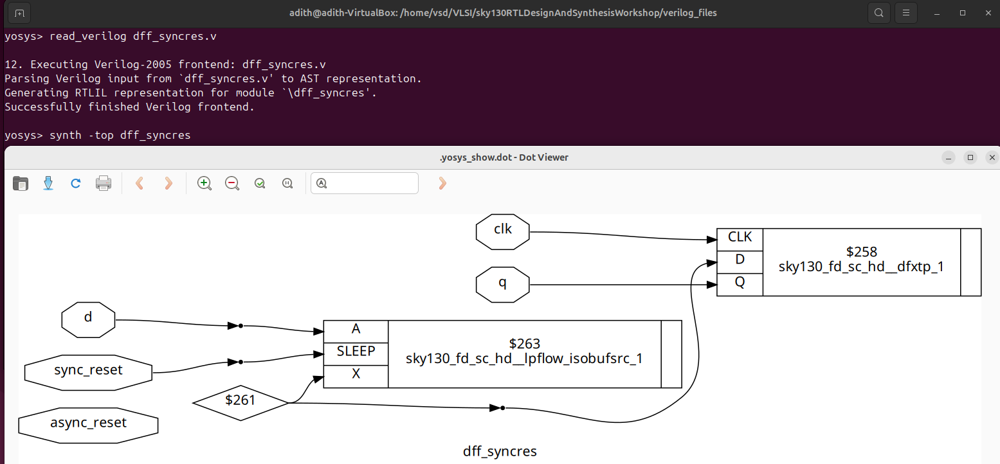
Reset works only on the next clock edge.

---

### 🖥️ Simulation Results

* **Async Reset** → Q goes low immediately.
* **Async Set** → Q goes high immediately.
* **Sync Reset** → Q goes low only on next rising clock.

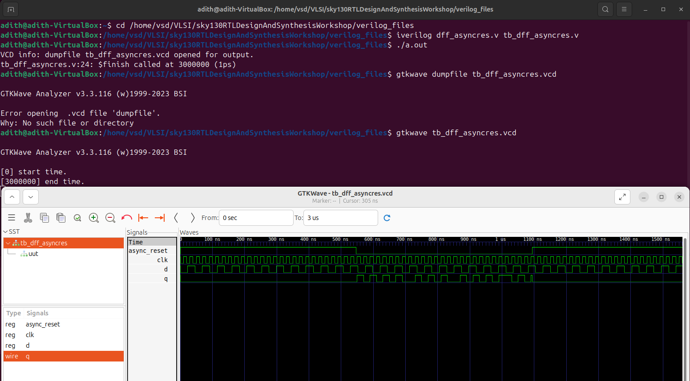
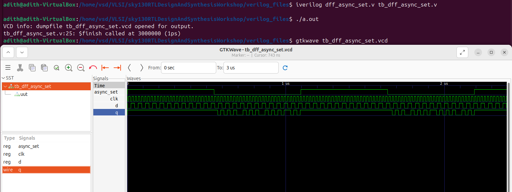
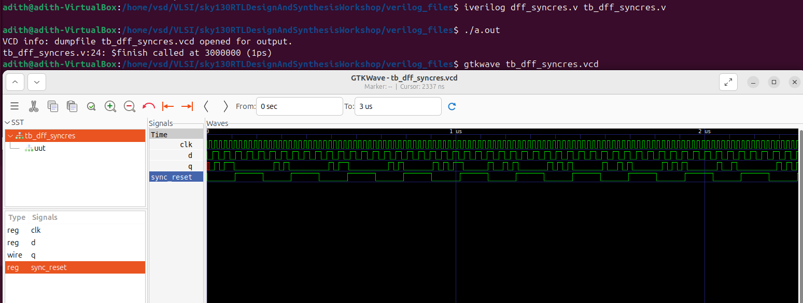

---

### 🛠️ Synthesis of Flops (Yosys)

Example for async reset:

```yosys
read_verilog dff_asyncres.v
read_liberty -lib sky130_fd_sc_hd__tt_025C_1v80.lib
synth -top dff_asyncres
dfflibmap -liberty sky130_fd_sc_hd__tt_025C_1v80.lib
abc -liberty sky130_fd_sc_hd__tt_025C_1v80.lib
show
```

📌 Result: RTL flops mapped to **sequential cells** in the Sky130 library.

---

### 📌 Summary of Verification

| Flop Type       | Simulation Observation                  | Netlist Mapping                         |
| --------------- | --------------------------------------- | --------------------------------------- |
| Async Reset DFF | Output clears immediately on reset high | Sky130 DFF cell with reset pin          |
| Async Set DFF   | Output sets immediately on set high     | Sky130 DFF cell with set pin            |
| Sync Reset DFF  | Output clears only at clock edge        | DFF cell with logic mapped into D-input |

---

## 🔹 4. Special Case RTL Optimizations

### 📖 Theory
In digital design, some arithmetic operations can be greatly simplified because of how **binary numbers work**.  
- Multiplying by a **power of two** is just a **left shift** (append zeros).  
- Multiplying by certain constants can be rewritten into **shift + add** operations.

📌 These optimizations save **hardware area and power**, since no real multiplier logic is needed — only rewiring.

---

### 🧪 Examples We Used

#### Example 1: Multiply by 2
```verilog
module mul2(a, y);
  input  [2:0] a;
  output [3:0] y;

  assign y = { a, 1'h0 };  // append one zero
endmodule
````

* If `a = 101 (5)`, then `y = 1010 (10)` → exactly `a * 2`.
* Yosys confirms that the result is just `a` followed by a `0`.
📷 Optimization Example 1: Multiply by 2
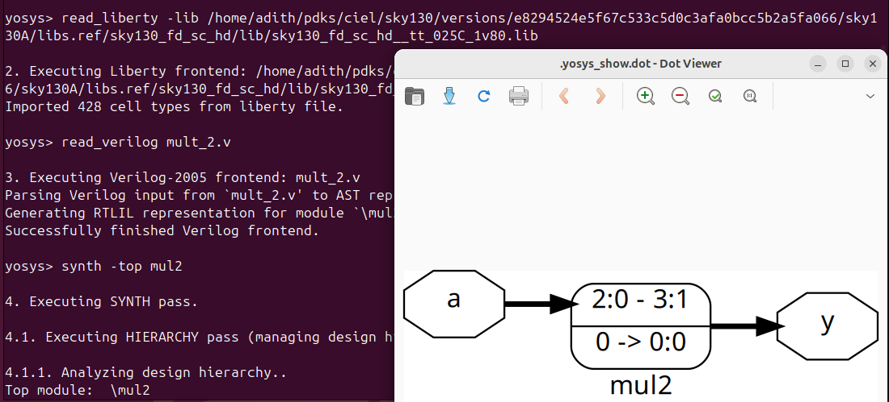
---

#### Example 2: Multiply by 9 (8 + 1)

$$
a \times 9 = a \times (8+1) = (a \ll 3) + a
$$

```verilog
module mult8(a, y); 
  input  [2:0] a; 
  output [5:0] y;

  assign y = { a, a };  // replicate 'a'
endmodule
```

* Here, `y` is simply `a` concatenated with itself.
* No multiplier needed — logic is implemented by wiring.
📷 Optimization Example 2: Multiply by 8/9
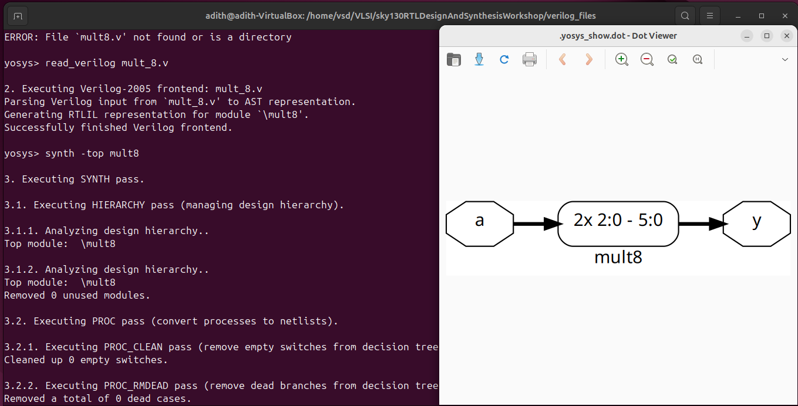
---

### 📌 Takeaway

* Multiplication by 2ⁿ → append `n` zeros (shift-left).
* Multiplication by other constants (like 9) → break into shift + add.
* Tools like Yosys automatically apply these optimizations.

---

## ✅ Conclusion for Day 2

Today I learned to connect **theory** with **practical synthesis flows**:

1. **Timing Libraries** (`.lib`):

   * How cells are described with function, timing, area, and power.
   * How PVT (Process, Voltage, Temperature) corners affect design.

2. **Hierarchical vs Flat Synthesis**:

   * Hierarchical keeps submodules, easier to debug.
   * Flat collapses everything, enabling global optimization.
   * Verified with the `multiple_modules` example and truth table simulation.

3. **Flip-Flop Coding Styles**:

   * Asynchronous reset, asynchronous set, synchronous reset.
   * Simulated and synthesized each one, saw how they map to Sky130 sequential cells.
   * Learned why flops are needed to avoid glitches.

4. **Special RTL Optimizations**:

   * Multiplication by powers of two or constants can often be replaced by rewiring.
   * Saves hardware resources and improves efficiency.

---

📌 **Big Picture:**
By the end of Day-2, I can now:

* Read and interpret Sky130 timing libraries.
* Understand and control synthesis hierarchy.
* Write and verify different flip-flop styles.
* Recognize common RTL optimizations that synthesis tools perform.

This foundation prepares me for more advanced synthesis, mapping, and timing analysis in the next labs.
