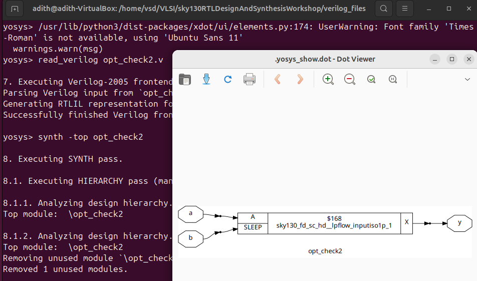
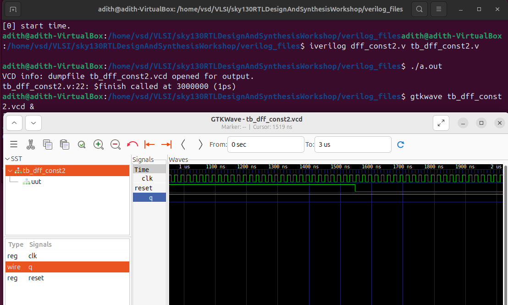
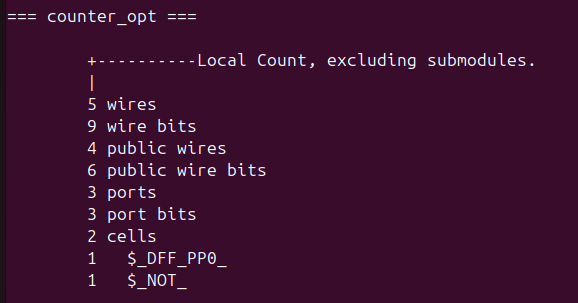

# Day 3 — Introduction to Logic Optimization

## Logic in Digital Circuits

In digital design, logic can be broadly categorized into two types:

* *Combinational Logic* – The output depends only on the current inputs.
* *Sequential Logic* – The output depends on both current inputs and the past history (stored state).

---

## Combinational Logic Optimization

Combinational logic optimization focuses on minimizing logic in order to obtain the most *area-efficient* and *power-efficient* design possible.
An optimized design not only saves chip resources but also improves performance and reduces cost.

### Key Techniques

#### 1. Constant Propagation

* *Theory*: Constant propagation is a direct optimization method where signals with constant values (0 or 1) are substituted throughout the circuit.

* This simplifies expressions and eliminates unnecessary gates.

* *Example Expression:*

  ```
  (A & B) | C
  ```

  If we know that *A = 0*, the term `(A & B)` becomes `0`. The whole expression simplifies to just `C`.

* *Impact on Hardware:*

  * Original circuit: `(A & B) | C` requires more gates.
  * CMOS implementation: \~6 MOS transistors.
  * Optimized circuit: Only an *inverter for C* (2 MOS transistors).
  * Result: Significantly reduced *area* and *power* usage.

* *Other Simplifications:*

  * `A & 0 → 0`
  * `A & 1 → A`
  * `A | 0 → A`
  * `A | 1 → 1`

#### 2. Boolean Logic Optimization

* *Theory*: Boolean logic optimization aims to reduce the complexity of logic expressions while preserving their functionality.

* This is based on Boolean algebra properties such as *absorption, distribution, consensus, and De Morgan’s laws*.

* *Examples:*

  * `A + AB → A` (Absorption law)
  * `A + A'B → A + B` (Consensus theorem)

* *Methods:*

  * *Karnaugh Maps (K-maps)* – A graphical technique for simplifying expressions up to 5–6 variables.
  * *Quine–McCluskey Algorithm* – A tabular, computer-friendly approach that works for larger expressions.

* *Impact:*

  * Fewer logic gates.
  * Shorter critical paths.
  * Reduced *area* and *power* consumption.

---

✅ These techniques form the foundation of optimization in synthesis flows, and are often automatically applied by EDA tools like *Yosys*.

---

### Boolean Logic Optimization Example

Consider the Verilog assignment:

```verilog
assign y = a ? (b ? c : (c ? a : 0)) : (!c);
```

This nested ternary (`?:`) operator behaves like a set of multiplexers:

* If `a = 0` → `y = !c`
* If `a = 1` → `y = (b ? c : (c ? a : 0))`

So the structure is essentially cascaded muxes.

**Step 1: Express as Boolean logic**

The mux with `c` as select:

```
(c ? a : 0) = A·C
```

The mux with `b` as select:

```
(b ? c : (c ? a : 0)) = (B·C) + (B'·AC)
```

Combine with the outer select (`a` vs `!c`):

```
y = A'·C' + A·(B·C + B'·A·C)
```

**Step 2: Simplify the expression**

Expand terms:

```
y = A'·C' + A·B·C + A·B'·A·C
```

Eliminate redundancy (`A·B'·A·C = A·B'·C`):

```
y = A'·C' + A·B·C + A·B'·C
```

Factor common terms in the last two terms:

```
y = A'·C' + A·C·(B + B')
```

Simplify (`B + B' = 1`):

```
y = A'·C' + A·C
```

**Step 3: Recognize XOR form**

The final expression matches the definition of XOR:

```
y = A ⊕ C
```

**Takeaway**

* Original expression: nested muxes (complex).
* Optimized expression: single XOR gate.
* Benefit: Saves multiple gates and reduces transistor count from many to just what's needed for XOR.

---

## Sequential Logic Optimization

Sequential optimization focuses on improving circuits that involve memory elements (flip-flops, latches). Unlike combinational optimization, here the output depends on both current inputs and stored state.

There are two main categories of techniques:

### 1. Basic Sequential Optimization

**Sequential Constant Optimization**

If a sequential element (like a flip-flop) always evaluates to a constant value (e.g., stuck at 0 or 1 regardless of inputs), the synthesis tool can remove it.

This reduces unnecessary state elements, saving area and power.

### 2. Advanced Sequential Optimization

**State Optimization**

Used in Finite State Machines (FSMs).

Minimizes the number of states, merges equivalent states, or re-encodes states to simplify next-state logic.

Leads to smaller, more efficient FSM implementations.

**Retiming**

A transformation that moves registers (flip-flops) across combinational logic without changing circuit behavior.

Goal: balance path delays, improve timing, and meet clock frequency targets.

**Sequential Logic Cloning (Floorplan-Aware Synthesis)**

Duplicates registers in different physical locations to reduce routing delay.

Particularly useful in large chips where long wires create timing bottlenecks.

---

### Sequential Constant Optimization

Sequential constant optimization happens when a flip-flop (or register) always evaluates to a fixed constant (0 or 1), making it redundant. The synthesis tool can safely remove such sequential elements and replace their outputs with constants.

#### Example 1: D Flip-Flop tied low with Reset

**Circuit:**

* `D` input tied to `0`
* `Reset` connected
* `Q` output drives a NAND gate with input `A`
* NAND output → `Y`

**Behavior:**

* With `Reset` active → `Q = 0`
* Without `Reset` → `D = 0`, so `Q` remains `0` on every clock edge
* Therefore, `Q` is always `0`

**Simplification:**

```
Y = (A · Q)' = (A · 0)' = 1
```

The whole circuit reduces to just `Y = 1`.

✅ This is a case where Sequential Constant Optimization applies.

#### Example 2: D Flip-Flop tied low with Set

**Circuit:**

* `D` input tied to `0`
* `Set` input connected
* `Q` drives NAND gate with input `A`
* NAND output → `Y`

**Behavior:**

* With `Set` active → `Q = 1` (asynchronous behavior)
* With `Set` inactive + clock event → `Q` follows `D = 0` (synchronous behavior)
* Thus, `Q` toggles between `1` (async) and `0` (sync).

**Why it cannot be optimized:**

* `Q` is not always constant.
* It cannot be simply labeled as `Set` or `Set'` because its behavior depends on both asynchronous `Set` and the synchronous clock.
* Removing the flop would break the timing semantics.
* Key Point: When asynchronous inputs (Set/Reset) are involved, outputs cannot always be reduced to constants.
* The flop must be preserved to maintain correct timing and behavior.

**ASCII waveform (from notes)**

```
Clock:  __|‾‾‾||‾‾‾||‾‾‾||‾‾‾|___
Set:    _______|‾‾‾‾‾‾‾‾‾‾|__________
Q:      _______|‾‾‾‾‾‾‾‾‾‾‾‾‾\______
                           (follows D=0 at next clock)
```

**Explanation**

* When `Set` goes high, `Q` immediately jumps to 1 (asynchronous behavior).
* When `Set` goes low, `Q` does not fall right away — instead, it waits until the next clock edge to capture `D` (which is `0` in this case).
* This illustrates why `Q` cannot simply be treated as `Set` or `Set'`.

---

**Another ASCII (Reset / D tied low)**

```
Clock:  __|‾‾‾||‾‾‾||‾‾‾||‾‾‾|___ 
Reset:  ‾‾‾‾‾‾|_|‾‾‾‾‾‾‾‾‾‾‾‾‾
D:      000000000000000000000000000000000
Q:      000000000000000000000000000000000
```

**Explanation**

* `D` is tied low permanently.
* When `Reset` is active, `Q = 0`.
* When `Reset` is released, the flop still samples `D = 0` on every clock edge → `Q` remains `0`.
* ✅ This confirms `Q` is a sequential constant → the entire flop can be optimized away.

---

### State Optimization (summary)

* Definition: Optimization of unused or redundant states in an FSM.
* By merging equivalent states, removing unreachable ones, or re-encoding states, we obtain the most condensed logic implementation.
* Benefits: smaller next-state logic, fewer flip-flops, reduced area and power.

### Sequential Logic Cloning (Floorplan-Aware Synthesis)

**Definition:** A physical-aware optimization where flip-flops are duplicated to reduce routing delay caused by long interconnects.

**Example Scenario (ASCII diagram included in notes):**

Without cloning (long routing delays)

```
       Logic
         |
       Flop A
         |
      ---------
      |       |
  (long)   (very long)
    |         |
  Flop B    Flop C
```

With cloning (shorter routes, less delay)

```
       Logic
         |
     Flop A clone1 ----> Flop B
         |
     Flop A clone2 ----> Flop C
```

**Explanation**

* Without cloning: A single flop (A) drives two distant flops (B and C). The long wires introduce routing delay.
* With cloning: The original flop is duplicated into two clones, each placed closer to their respective destinations.
* ✅ This reduces wire length, improves timing, and is especially useful in floorplan-aware synthesis.

### Retiming

Retiming is a sequential optimization that moves registers (flip-flops) across combinational logic without changing the circuit’s functional behavior. The goal is to balance combinational delays between registers so the worst-case path is shorter — which raises the maximum clock frequency.

**Concept / formula**

If a path between two registers has combinational delay `T_comb`, and register timing overheads (clock-to-Q `T_cq` and setup `T_setup`) are negligible or included elsewhere, the maximum clock frequency for that path is:

```
f_max = 1 / T_comb
```

For a multi-register pipeline, the circuit's global `f_max` is limited by the largest combinational delay between any pair of registers:

```
f_max_global = 1 / max(T_comb_i)
```

**Numeric example (from notes)**

* Path1 (between Flop A and Flop B): `T1 = 5 ns`
* Path2 (between Flop B and Flop C): `T2 = 2 ns`

Initial maximum frequencies:

```
f_max_path1 = 1 / 5 ns = 200 MHz
f_max_path2 = 1 / 2 ns = 500 MHz
f_max_global = 200 MHz
```

Retiming example (splitting logic):

* After moving logic into stage 2:

  * `T1' = 4 ns`, `T2' = 3 ns`

```
f_max_path1' = 1 / 4 ns = 250 MHz
f_max_path2' = 1 / 3 ns ≈ 333.3 MHz
f_max_global' = 250 MHz
```

**Takeaway:** Retiming reduced the critical path from `5 ns` to `4 ns` and raised the global clock speed from `200 MHz → 250 MHz`.

**Visual (ASCII)**

Before retiming (imbalanced)

```
Flop A ---[ Logic T = 5ns ]--- Flop B ---[ Logic T = 2ns ]--- Flop C
f_max = 1 / max(5ns, 2ns) = 200 MHz
```

After retiming (balanced)

```
Flop A ---[ Logic T = 4ns ]--- Flop B ---[ Logic T = 3ns ]--- Flop C
f_max = 1 / max(4ns, 3ns) = 250 MHz
```

---

## Lab 6 — opt\_check (Logic optimization with Yosys)

### Corrected Verilog sources

**`opt_check.v`**

```verilog
module opt_check (
    input  a,
    input  b,
    output y
);
    // Multiplexer style: if a then b else 0
    assign y = a ? b : 0;
endmodule
```

**`opt_check2.v`**

```verilog
module opt_check2 (
    input  a,
    input  b,
    output y
);
    // if a then 1 else b
    assign y = a ? 1 : b;
endmodule
```

**`opt_check3.v`**

```verilog
module opt_check3 (
    input  a,
    input  b,
    input  c,
    output y
);
    // nested ternaries => a ? (c ? b : 0) : 0
    assign y = a ? (c ? b : 0) : 0;
endmodule
```

> Notes: I fixed indentation and the input/output syntax so these files are valid Verilog.

---

### What the expressions simplify to (why)

* `assign y = a ? b : 0;`
  This is logically `y = a & b` (mux with `a` select outputs `b` when `a=1`, otherwise `0`).

* `assign y = a ? 1 : b;`
  This simplifies to `y = a | b` (when `a=1` output is `1`, otherwise `b`).

* `assign y = a ? (c ? b : 0) : 0;`
  The inner `(c ? b : 0)` is `b & c`. The outer mux makes it `a & (b & c)` → `a & b & c` (3-input AND).

---

### Yosys flow used in lab

Start Yosys in your terminal:

```sh
yosys
```

(Optional) Read a Liberty timing/cell library if you have one:

```yosys
read_liberty -lib <path-to-liberty-file>
```

Read your Verilog file and set the top module, then run synthesis:

```yosys
read_verilog opt_check.v
synth -top opt_check
```

Run optimization / clean passes (constant propagation, boolean simplification, dead code elimination):

```yosys
opt_clean -purge
```

`opt_clean -purge` runs optimizations and removes unused wires/instances. After this, many mux-like constructs reduce into simple gates.

(Optional) Run `abc` with a Liberty model to do technology-aware resynthesis:

```yosys
abc -liberty <path-to-liberty-file>
```

> Note: the lab notes said `abd -liberty` — the correct Yosys helper command is `abc` (the ABC synthesis tool integrated into Yosys).

Inspect the result using `show`:

```yosys
show
```

`show` creates an image (PNG/SVG) of the current netlist/graph so you can visually verify the gate produced (AND/OR/XOR, etc). `show` writes files into the current directory (e.g., `show.png`) — check the filename output on the Yosys console.

Good practice: write out the cleaned/optimized netlist so you can inspect or use it in further flows.

---

### Results from the lab

* `opt_check.v` (`a ? b : 0`) → expected **AND** gate.
  After `opt_clean` (and optionally `abc`), Yosys simplifies and you should see a 2-input AND.

* `opt_check2.v` (`a ? 1 : b`) → expected **OR** gate.
  The video showed a different image for the second case; your output may differ depending on whether Yosys/ABC used available library cells or left an implementation in gates. The logical function is `a | b`.

* `opt_check3.v` → simplifies to a **3-input AND** (`a & b & c`).

* `opt_check4.v` → simplifies to a **3-input AND** (`a & b & c`).

For multiplemodulesopt (a multi-module design): flatten the design before `opt_clean -purge` if you want cross-module optimizations:

```yosys
read_verilog multiplemodulesopt.v
flatten
opt_clean -purge
```

## DFF constant examples (`dff_const1` … `dff_const5`)

### 1) `dff_const1` — corrected source & behavior

```verilog
module dff_const1 (
    input  clk,
    input  reset,
    output reg q
);
    always @(posedge clk, posedge reset) begin
        if (reset)
            q <= 1'b0;   // asynchronous reset -> immediate 0
        else
            q = 1'b1;    
    end
endmodule
```

**What it does (cycle-by-cycle)**

* If reset is asserted (high): `q` is set immediately to `0` (asynchronous).
* When reset is released, nothing happens until the next rising `clk` edge: on that clock the `else` branch executes and `q` is assigned `1` (with a blocking `=` in your original code).
* So `q` is not a constant: it is `0` when reset is asserted, and becomes `1` at the next clock after reset is released.

**ASCII waveform (expected)**

```
Time ->     ...    t_reset_high   t_reset_low   clk↑    clk↑
Reset:      ----|‾‾‾‾‾‾‾‾|---------
Clock:      __|‾‾‾||‾‾‾|_|‾‾‾|
Q:          -----0--------0------1-------
             (async 0)    (still 0)  (becomes 1 on clk)
```


**Synthesis behavior**

* The flop is kept. `q` is not constant because it changes depending on clock after reset is removed. So tools will not remove this register.
* You should prefer `q <= 1'b1` (non-blocking) in the `else` branch to avoid subtle simulation differences when multiple registers are assigned in the same always block.

---

### 2) `dff_const2` — corrected source & behavior

```verilog
module dff_const2 (
    input  clk,
    input  reset,
    output reg q
);
    always @(posedge clk, posedge reset) begin
        if (reset)
            q <= 1'b1;
        else
            q <= 1'b1;
    end
endmodule
```

**What it does**

* Both branches (reset and normal clock path) assign `q = 1`. That means regardless of clock or reset, the register output is always `1`.
* Because the register never changes from `1` under any reachable condition, it is a sequential constant.

**ASCII waveform**

```
Reset:  ----|‾‾‾‾‾|---------
Clock:  __|‾‾‾||‾‾‾|___
Q:      1111111111111111111
```


**Synthesis behavior**

* A synthesis tool (Yosys) can remove the flip-flop and replace `q` with a constant net tied to `1`.
* Downstream logic that used `q` will be simplified (constant propagation), possibly collapsing gates that depended on `q`.

---

### 3) `dff_const3` — corrected & explained

**Corrected Verilog (fixed syntax and consistent nonblocking):**

```verilog
module dff_const3 (
    input  clk,
    input  reset,
    output reg q
);
    reg q1;
    always @(posedge clk, posedge reset) begin
        if (reset) begin
            q  <= 1'b1;
            q1 <= 1'b0;
        end else begin
            q1 <= 1'b1;
            q  <= q1;
        end
    end
endmodule
```

**Cycle-by-cycle (non-blocking semantics)**

* During reset: `q = 1`, `q1 = 0` (asynchronous assignments).
* First rising clock after reset release:

  * `q1 <= 1` (will become `1`)
  * `q <= q1` (captures the old `q1 = 0`) → `q` becomes `0`
* Second rising clock:

  * `q1 <= 1` (stays `1`)
  * `q <= q1` (captures old `q1 = 1`) → `q` becomes `1`
* After that: both `q1` and `q` remain `1` forever (unless reset again).

So `q` sequence: `... 1 (during reset) -> 0 (first clock) -> 1 (second clock) -> 1 ...`

**ASCII waveform**

```
Reset:  ----|‾‾‾‾‾|---------
Clock:  __|‾‾‾||‾‾‾|_|‾‾‾|
q1:     000... (becomes 1 on first clk)
q:      111... (during reset) -> 0 (1st clk) -> 1 (2nd clk) -> 1 ...
```


**Synth behavior**

* Not constant. `q` takes different values over time (1 during reset, then 0 for one clock, then 1). Tool cannot replace `q` with a single constant.
* All registers must be kept in synthesis because the outputs are time-dependent and the transient behavior after reset matters.

---

### 4) `dff_const4` 

```verilog
module dff_const4 (
    input  clk,
    input  reset,
    output reg q
);
    reg q1;

    always @(posedge clk, posedge reset) begin
        if (reset) begin
            q  <= 1'b1;
            q1 <= 1'b0;
        end else begin
            q1 <= 1'b1;
            q  <= q1;
        end
    end
endmodule
```
**Cycle-by-cycle (non-blocking semantics)**

*During reset:`q = 1`, `q1 = 0` (asynchronous behavior).
*First rising clock after reset release

  *`q1 <= 1` (scheduled to update to `1`)
  *`q <= q1` (captures the old `q1 = 0`) → q becomes `0`
*Second rising clock

  *`q1 <= 1` (remains `1`)
  *`q <= q1` (captures the old `q1 = 1`) → q becomes `1`
  *Both `q1` and `q` remain `1` indefinitely, unless reset is asserted again.

Resulting sequence for q:
`
... 1 (during reset) → 0 (first clock after reset) → 1 (second clock) → 1 (steady state)
`

* Corrected and intended behavior is identical to `dff_const3` . Not a sequential constant → flop kept.*


---

### 5) `dff_const5` — corrected & explained

```verilog
module dff_const5 (
    input  clk,
    input  reset,
    output reg q
);
    reg q1;
    always @(posedge clk, posedge reset) begin
        if (reset) begin
            q  <= 1'b0;
            q1 <= 1'b0;
        end else begin
            q1 <= 1'b1;
            q  <= q1;
        end
    end
endmodule
```

**Cycle-by-cycle**

* During reset: `q = 0`, `q1 = 0`.
* First clk after reset release:

  * `q1 <= 1` (will become `1`)
  * `q <= q1` (captures old `q1 = 0`) → `q` remains `0`
* Second clk:

  * `q1 <= 1`
  * `q <= q1` (old `q1 = 1`) → `q` becomes `1`

So `q` is `0` during reset and remains `0` for the first clock, then becomes `1` on the second clock — again not constant.

**Synth behavior**

* Not constant; flops are required to implement that transient behavior.


---

Perfect 👍 — this is exactly the kind of section that belongs in your **Day 3 README**.
Here’s how I would fold your cleaned-up `counter_opt` / unused-output optimization chunk into the structured README we built earlier.

I’ll keep formatting consistent, add it in the correct order (under *Sequential optimizations for unused outputs*), and preserve your explanations, code, waveforms, and Yosys flow.

---

## Sequential optimizations for unused outputs

### Unused-Output Optimization (`counter_opt`)

**Concept:**
Synthesis tools remove or avoid implementing logic that is not observable at the outputs. If internal state bits are never used (read) by the design’s outputs or by other logic that matters, the tool may avoid instantiating hardware for them.

---

#### `counter_opt.v` — original (cleaned)

```verilog
module counter_opt (
    input        clk,
    input        reset,
    output       q
);
    reg [2:0] count;

    assign q = count[0];

    always @(posedge clk or posedge reset) begin
        if (reset)
            count <= 3'b000;
        else
            count <= count + 1;
    end
endmodule
```

**Behavior (functional):**
This is a 3-bit up-counter: `0,1,2,3,4,5,6,7,0,...`. The module only **exposes** `count[0]` as the output `q`. That LSB toggles every clock.

**Why synthesis can drop flops:**
Because only `count[0]` is used externally, the synthesizer can implement *only the logic necessary to produce `q`*. It does not need to implement the other two counter bits if they are not observed or used.

For `count[0]`, its next value is simply the inverse of the current `count[0]`. The tool usually implements `count[0]` as a single D-FF with `D = ~Q` (or a T-FF equivalent), and removes the other two flip-flops completely.



**Net effect:** far smaller area and simpler logic, since unused state is optimized away.

---

#### Modified RTL that *uses* all bits

```verilog
module counter_opt2 (
    input        clk,
    input        reset,
    output       q
);
    reg [2:0] count;

    // new: q is true only when count == 3'b000
    assign q = (count == 3'b000);

    always @(posedge clk or posedge reset) begin
        if (reset)
            count <= 3'b000;
        else
            count <= count + 1;
    end
endmodule
```

**Why synthesis now keeps 3 flops:**
The expression `count == 3'b000` reads all three bits. The synthesizer must implement the full 3-bit counter so that `q` will be `1` only at the correct times. Therefore the three flip-flops are retained and a small comparator (equality to zero) is generated to produce `q`.

---

**What to look for in the `show` output:**

* **`counter_opt` (original):** one D-FF (for `count[0]`) and a feedback inverter (D = \~Q). No adder or other flops.
* **`counter_opt2` (modified):** three D-FFs (full counter) and comparator logic for `count == 0`.

---

The internal sequence for `count` still conceptually follows 0..7, but since higher bits are unused externally they may not be implemented in the final netlist.

---


On Day 3, I learned how logic optimizations — both combinational and sequential — are applied in digital design to make circuits smaller, faster, and more power-efficient without changing their functional behavior.

Combinational optimizations such as constant propagation and Boolean simplification reduce gate count and transistor usage by exploiting algebraic properties and known constants. These techniques shorten critical paths and minimize area/power, and are automatically handled by synthesis tools like Yosys.

Sequential optimizations extend these ideas to circuits with memory. Techniques like sequential constant removal, state minimization in FSMs, retiming, and sequential cloning help eliminate redundant registers, balance timing, and reduce interconnect delays. Importantly, sequential optimization must preserve temporal behavior across resets and clock edges, making it more subtle than purely combinational simplification.

Through practical labs (opt_check, dff_const1..5), I observed how synthesis tools analyze and optimize RTL. Some flip-flops (e.g., dff_const2) were reduced to constants because their outputs never changed, while others had to be preserved due to transient behavior after reset. This demonstrated how coding style and output usage directly affect hardware realization.

Overall, Day 3 showed me that optimization is at the heart of digital design. Understanding how synthesis interprets RTL helps write efficient, intention-driven code and allows me to predict what will be preserved or simplified. This bridges theory with practical VLSI design and strengthens my ability to debug, optimize, and guide synthesis results effectively.
