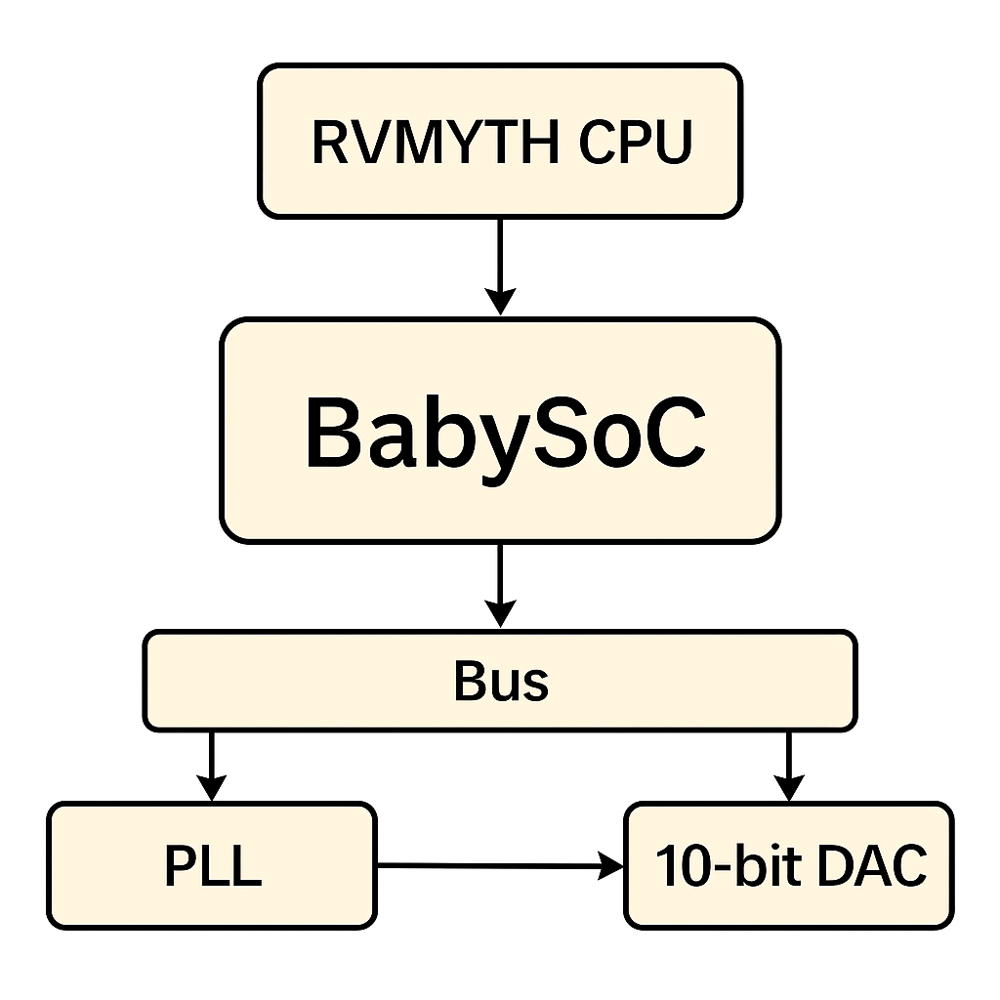
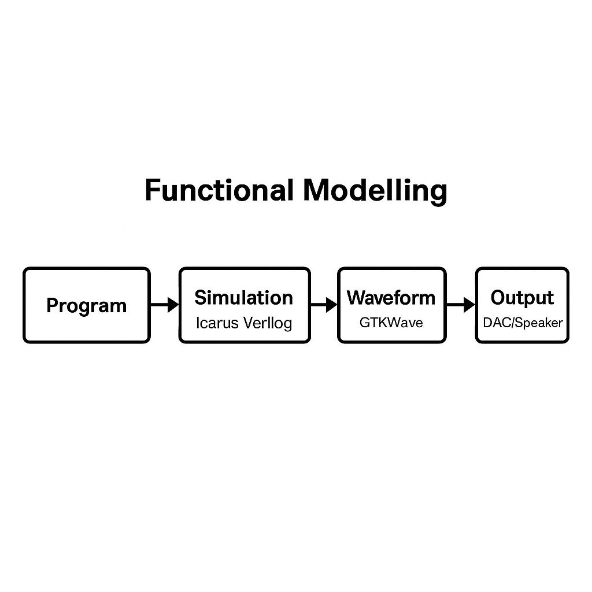
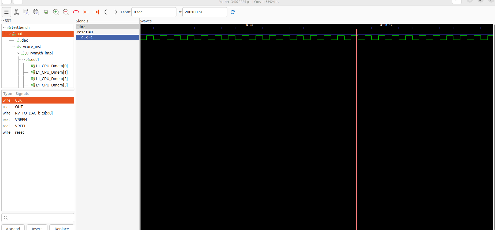
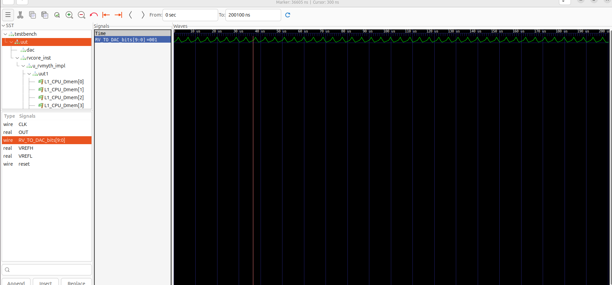
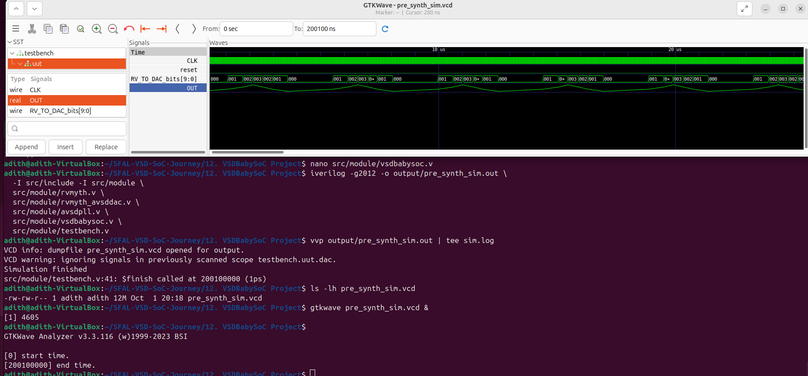
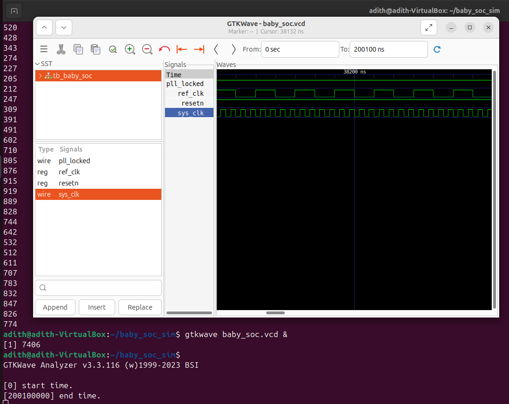

# Week 2 — BabySoC Fundamentals & Functional Modelling

## Overview

This week I explored **BabySoC**, a minimal RISC-V based System-on-Chip (SoC) that includes a small CPU (RVMYTH), a PLL, and a 10-bit DAC.  
The goal was to run **pre-synthesis functional simulations** (using Icarus Verilog + GTKWave) and understand how the SoC behaves when software runs on the CPU.

**What I produced:**
- Notes on theory (this write-up).
- Simulation logs and `.vcd` waveforms.
- GTKWave screenshots with short explanations.

---

## What is a SoC?

A **System-on-Chip** basically puts the main parts of a computer—CPU, memory, interconnect, and peripherals—onto a single chip.  
In real life this makes devices smaller, cheaper, and more efficient. BabySoC is stripped down so that we can actually see how each part works in simulation.

---

## Key Blocks in BabySoC

## BabySoC Block Diagram

- **RVMYTH CPU** — executes instructions.  
- **Memory** — small ROM/RAM for instructions and data.  
- **Bus** — connects CPU to peripherals with simple handshakes.  
- **DAC (10-bit)** — memory-mapped peripheral that converts digital values into analog output.  
- **PLL** — gives a stable system clock.  
- **Reset logic** — makes sure the CPU starts cleanly.  

---

## Why It’s a Good Teaching Model

- Simple enough to follow, but still a real SoC.  
- Every important signal (reset, clock, PC, bus, DAC) is visible in waveforms.  
- Simulations run fast so iteration is quick.  
- Shows the link between **software instructions → hardware signals → real output** (like sound).

---

## Functional Modelling (Before Synthesis)

## Functional Modelling Flow

The idea here is to check if the design works functionally before worrying about timing or gates.

**Benefits:**
- Find design bugs early.  
- Quick turnaround compared to gate-level sims.  
- Lets me see how code running on the CPU drives hardware.  

**Tools I used:**
- `iverilog` + `vvp` for simulation.  
- `gtkwave` for waveform viewing.  

---

## Simulation Flow (What I Did)

1. Installed/used `iverilog`, `vvp`, `gtkwave`.  
2. Compiled top-level modules (`vsdbabysoc.v`, `rvmyth`, `avsddac`, `avsdpll`, `testbench.v`).  
3. Made sure `$dumpfile` and `$dumpvars` were in the testbench:  

   ```verilog
   initial begin
     $dumpfile("pre_synth_sim.vcd");
     $dumpvars(0, testbench);
   end
   ```

4. Ran:

   ```bash
   iverilog -I src/include -o build/pre_synth_sim.out \
     src/module/testbench.v \
     src/module/vsdbabysoc.v \
     src/module/rvmyth_avsddac_stripped.v \
     src/module/avsddac.v \
     src/module/avsdpll.v

   vvp build/pre_synth_sim.out | tee build/sim_log.txt
   ```

5. Opened the VCD in GTKWave and looked at:

   * `clk`, `pll_locked`, `reset`
   * `pc`, `instr`
   * `addr`, `we`, `wdata`, `valid`, `ready`
   * `RV_TO_DAC_bits`, `OUT`

---

## Waveform Screenshots I Collected
### Reset + Clock


### DAC Output


### Overview (All signals together)


---

## Simulation Log
See the full [sim.log](./sim.log) for the simulation messages.

## Waveform File
Download and open in GTKWave: [pre_synth_sim.vcd](./pre_synth_sim.vcd)

---


## 🎵 Example: Audio Signal Generation

To connect everything I learned in Week 2, here’s a simple example of how BabySoC could generate an audio tone.

### Step 1 – Clock and Reset


- **ref_clk** is the reference input to the PLL.  
- **pll_locked** goes high once the PLL output is stable.  
- **sys_clk** becomes the system clock for the CPU.  
- **resetn** is released only after the PLL locks, so the CPU starts cleanly.

This marks the real “start” of the SoC — once reset is lifted, the CPU begins execution.

---

### Step 2 – CPU Program
The CPU fetches instructions from memory.  
A small program holds a sine lookup table and writes values to the **DAC register** at a steady rate (~44 kHz).  
Every write shows up as bus activity (`RV_TO_DAC_bits` changing).

---

### Step 3 – DAC Output
The DAC converts the digital values into a staircase waveform.  
In GTKWave, this is visible as the analog-formatted `OUT` signal.  

---

### Step 4 – Real World Signal
The staircase waveform is passed through a simple RC filter, which smooths it into a sine wave.  
When connected to a speaker, this becomes a **pure audio tone**.

---

👉 This flow (Clock → Reset → CPU → Bus → DAC → Speaker) ties together all the pieces of BabySoC and shows how digital logic can produce real-world signals.

---

## Common Debugging Notes

* **Empty VCD?** Add `$dumpfile`/`$dumpvars` at top level.
* **Duplicate modules?** Check for multiple includes.
* **Port mismatch?** Double-check top-level connections.
* **DAC flat output?** Likely CPU isn’t running → check reset & PC signals.

---

## Takeaways

* Understood how a simple RISC-V SoC ties CPU, PLL, DAC, and bus together.
* Learned why functional modelling is important before synthesis.
* Practiced running a full simulation → logs → VCD → waveforms.
* Got comfortable debugging common testbench issues.
* Saw how software (lookup table + timer) directly creates hardware output (DAC writes → sound).

---
